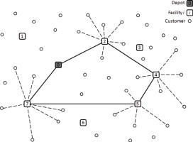

# Traveler-Salesman-Problem Using Simulated Annealing
The simulated annealing algorithm is an optimization method
which mimics the slow cooling of metals, which is characterized 
by a progressive reduction in the atomic movements that reduce the 
density of lattice defects until a lowest-energy state is reached

# Traveler-Salesman-Problem Using Simulated Annealing
The travelling salesman problem (also called the commis-voyageur problem or TSP) asks the following question: "Given a list of cities and the distances between each pair of cities, what is the shortest possible route that visits each city exactly once and returns to the origin city?" It is an NP-hard problem in combinatorial optimization, important in theoretical computer science and operations research.

The travelling purchaser problem and the vehicle routing problem are both generalizations of TSP.

In the theory of computational complexity, the decision version of the TSP (where given a length L, the task is to decide whether the graph has a tour of at most L) belongs to the class of NP-complete problems. Thus, it is possible that the worst-case running time for any algorithm for the TSP increases superpolynomially (but no more than exponentially) with the number of cities.

